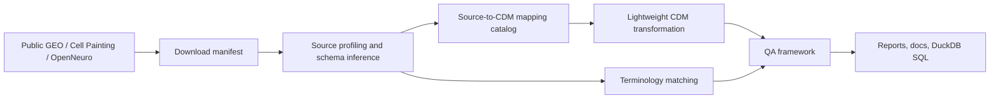

# Large-Scale Biomedical Data Harmonization & QA Platform

Specification-oriented portfolio project for public biomedical data harmonization, source-to-CDM mapping, ETL requirements, terminology alignment, lineage tracking, QA acceptance criteria, and FAIR-aligned documentation.

This project is aimed at a healthcare Data Harmonization Analyst / Data Science Analyst profile: NAMs-style data workflows, source-to-common-model mapping, functional ETL specifications, data quality review, terminology alignment, metadata standards, and contributor-facing documentation.

## Why This Matters

Biomedical research data often arrives from heterogeneous repositories, assays, instruments, and contributor teams. Before data can be reused responsibly, teams need to profile source structures, define mapping logic, align terminology, preserve lineage, and run clear QA checks. This project demonstrates that work using real public data, not synthetic toy records.

## Public Data Sources

| Domain | Source | Dataset used | Default data |
|---|---|---|---|
| Transcriptomics | NCBI GEO | GSE2034 | Series Matrix metadata and processed expression values |
| Microscopy | Broad Institute Cell Painting Gallery | cpg0000 JUMP pilot plate BR00116991 | Well-level Cell Painting profile CSV |
| Electrophysiology | OpenNeuro | ds004504 | BIDS metadata and participant files |

No PHI, private clinical records, or protected patient-level data are used. Raw microscopy images and raw EEG signal files are disabled by default.

## Architecture



## Workflow

1. Download public metadata/profile files with retry, skip, checksum, and failure reporting.
2. Build a manifest for raw/interim/CDM/output files.
3. Profile source files with chunked CSV/TSV/gzip/parquet handling.
4. Infer schemas and generate a source-to-CDM mapping catalog.
5. Apply lightweight CDM transformations with lineage fields.
6. Match source terms to simplified controlled vocabularies.
7. Run QA checks and write acceptance summaries.
8. Generate a consolidated run report.

## Sample vs Full Mode

`config/runtime.yaml` defaults to:

```yaml
mode: sample
sample_rows: 50000
chunk_size: 100000
enable_full_download: false
enable_raw_images: false
enable_raw_signal_files: false
```

Sample mode is laptop-friendly. Full mode processes all available configured metadata/profile rows but still excludes raw images/signals unless explicitly enabled.

## How To Run

```bash
make install
make all-sample
```

Individual steps:

```bash
make download
make manifest
make profile
make mapping
make transform
make terminology
make qa
make reports
make test
```

Query CDM outputs with DuckDB:

```bash
duckdb -c "SELECT assay_type, COUNT(*) FROM read_csv_auto('data/cdm/cdm_assay.csv') GROUP BY assay_type;"
duckdb < sql/qa_summary_queries.sql
```

## Expected Outputs

| Output | Purpose |
|---|---|
| `data/manifests/download_manifest.csv` | Download status, file size, timestamp, checksum |
| `data/manifests/data_manifest.csv` | File inventory and lineage |
| `data/outputs/source_profile_summary.csv` | File-level profiling |
| `data/outputs/source_column_profile.csv` | Column-level profiling |
| `data/outputs/source_to_cdm_mapping_catalog.csv` | Field-level mapping catalog |
| `data/cdm/*.csv` | Lightweight CDM tables |
| `data/outputs/terminology_alignment_report.csv` | Controlled vocabulary match recommendations |
| `data/outputs/qa_results.csv` | QA rule results |
| `data/outputs/harmonization_run_report.md` | Consolidated report |

## Sample Mapping Catalog Rows

| source_field | target_cdm_table | target_cdm_field | mapping_status |
|---|---|---|---|
| geo_accession | cdm_sample | sample_id | mapped |
| Metadata_Well | cdm_sample | sample_id | mapped |
| Cells_* | cdm_morphology_profile | feature_value | mapped |
| participant_id | cdm_subject | subject_id | mapped |

## Sample QA Summary

| QA Rule | Dimension | Acceptance |
|---|---|---|
| QA-COMP-001 | completeness | source_system populated for all mapped records |
| QA-UNIQ-001 | uniqueness | primary keys unique |
| QA-CONF-001 | conformance | assay_type belongs to controlled vocabulary |
| QA-REF-001 | referential integrity | every foreign key resolves to an existing parent record |
| QA-MAP-001 | mapping coverage | at least 80% mapped or partially mapped |

## Sample Terminology Alignment Output

| source value | recommended term | status |
|---|---|---|
| assay_type | Cell Painting / EEG / microarray | auto_mapped or review_required |
| Cells_Texture_* | texture | review_required |

## Large-Scale Design

The code supports chunked reading, gzip/TSV/CSV/parquet files, configurable row limits, resumable downloads, local caching, manifest tracking, checksums, lineage columns, progress logging, explicit failure reports, and separate sample/full modes. Raw images and raw signal files are not downloaded by default because the role-relevant deliverable is harmonization and QA design.

## Limitations and Next Steps

- This is OMOP/CDM-style modeling, not a certified full OMOP implementation.
- Controlled vocabularies are simplified examples, not licensed UMLS/SNOMED/LOINC integrations.
- Cell Painting mapping unpivots a bounded feature subset in sample mode; full production use should write partitioned parquet.
- OpenNeuro raw signal files are excluded unless explicitly enabled.
- Next steps: add BIDS recursive metadata discovery, dbt/DuckDB pipeline orchestration, steward review UI, and formal vocabulary service integration.
